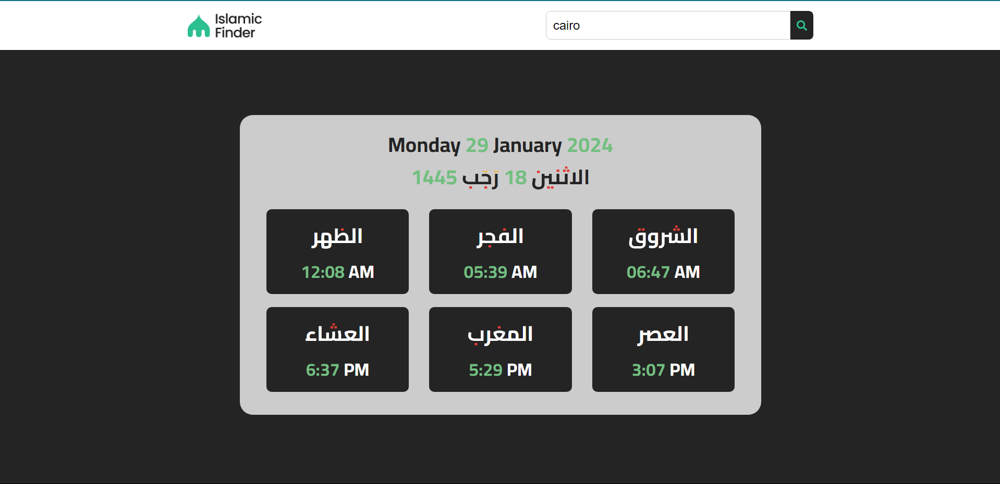

# Prayer Times

</img>

> Get your current city pray times

## Try it Live!

Check out the live app [Prayer Times](https://mahmoud-mohsen-dev.github.io/prayer-times/)

## How to Use

Search by city names. Like `cairo`, `aswan`, `suiz` to get the current prayer time for that city (works only with Egypt's cities).

Note click on search icon after entering city name. Enter button on the keyboard won't work!

## Tools Used

-   JavaScript
-   Axios
-   HTML
-   CSS

## Getting Started

1. Clone this repository.

    ```bash
    git clone https://github.com/mahmoud-mohsen-dev/prayer-times.git
    ```

2. Navigate to the Project Directory:
    ```bash
    cd prayer-times
    ```
3. Development Server

    Run the project with Live server

    or just open `index.html` file on the browser

Now you have the "Prayer Times" app up and running on your local machine.
